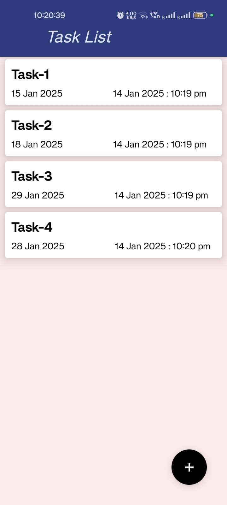
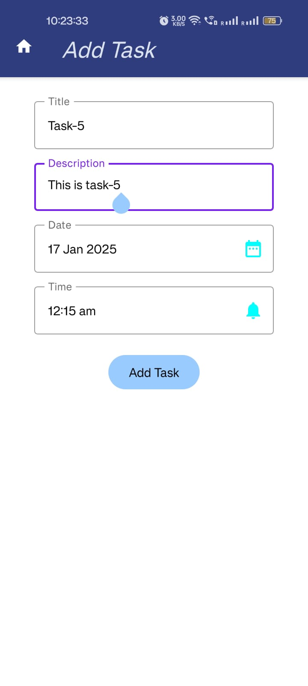
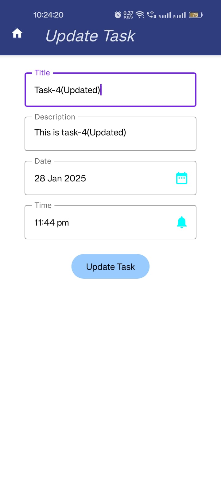

# 📋 Task Manager App  

A modern, user-friendly Android app for organizing and managing your daily tasks efficiently. Built with Jetpack Compose, Room Database, and Material Design 3, the app provides an intuitive interface to add, edit, and delete tasks seamlessly.  

---

## ✨ Features  

- ✅ **Add Tasks**: Easily add tasks with deadlines.  
- 🖊️ **Edit Tasks**: Update your existing tasks with a simple interface.  
- 🗑️ **Delete Tasks**: Swipe to delete tasks effortlessly.  
- 📅 **Schedule Deadlines**: Set specific dates and times for tasks using a beautiful date and time picker.  
- 🌙 **Modern UI**: Eye-catching design with Material Design 3 and Jetpack Compose.  
- 📦 **Offline First**: Fully functional without an internet connection, thanks to Room Database integration.  

---

## 🛠️ Technologies Used  

- **Kotlin**: For robust, type-safe programming.  
- **Jetpack Compose**: To build modern, declarative UIs.  
- **Room Database**: For local data storage and seamless CRUD operations.  
- **Material Design 3**: For a visually appealing and intuitive design.  

---

## 📸 Screenshots  

### Task List  
  

### Add Task  
  

### Edit Task  
  

---

## 🚀 Getting Started  

Follow these steps to set up the project locally:  

### Prerequisites  
1. **Android Studio**: Download and install [Android Studio](https://developer.android.com/studio).  
2. **Java/Kotlin Knowledge**: Basic understanding of Kotlin and Android development.  

### Installation  

1. **Clone the Repository**  
   ```bash  
   git clone https://github.com/awhanray-05/Task-Manager-App.git  
   cd Task-Manager-App  
